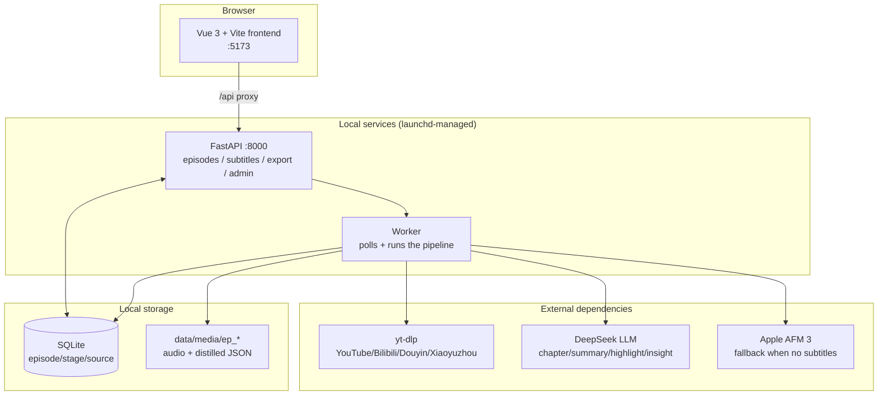

<div align="center">

# 🎙️ Podcast Digester

**Turn any podcast / video link into structured knowledge you can act on in 5 minutes.**

Paste a link → auto-download, transcribe, chapter, summarize, extract highlights → bilingual subtitles with click-to-seek.

A local-first, single-user tool built for high-density information consumers — PMs, researchers, investors.


</div>

🌐 [简体中文](./README.md) | **English**

---

## ✨ The Problem It Solves

When you face a 2-hour podcast, the real cost isn't *understanding* it — it's **not knowing whether it's worth your time.** Podcast Digester distills an episode into:

- A one-line **TL;DR** + a **worth-listening verdict** (Deep Listen / Skim / Skip — defaults to Skim when unsure)
- A **chapter outline** with per-chapter Chinese summaries
- Five kinds of **highlights**: `fact` / `insight` / `quote` / `contrarian` / `story`, each with the original subtitle citation and a timestamp
- **Product / technical / market** insights, plus a list of companies mentioned
- **Bilingual subtitles** precisely aligned to the player timeline — click a chapter or highlight to seek

> Decide in 5 minutes; when you choose to deep-listen, the subtitles and highlights help you skim-listen.

## 🖼️ Screenshots

<div align="center">
<table>
<tr>
<td align="center"><b>Library</b></td>
<td align="center"><b>Player · chapters / summary / highlights</b></td>
</tr>
<tr>
<td></td>
<td></td>
</tr>
</table>
</div>

## 🧠 Pipeline

Each episode flows through these stages in order, with **resumable checkpoints** (per-stage JSON + SQLite state):


Chinese sources auto-skip `translate`; platform subtitles that already have proper punctuation auto-skip `polish` — avoiding needless LLM cost.

## 🏗️ Architecture



**Fully local-first:** media files and all distilled artifacts live on your own disk; only LLM calls, platform fetches, and (subtitle-less) speech recognition go over the network.

## 📥 Multi-source Support

| Source | Notes |
|------|------|
| **YouTube** | Prefers platform subtitles (manual / auto CC); fail-fast probe falls back to ASR when none exist |
| **Bilibili** | Anti-bot requires cookies: auto-uses your browser (Chrome, etc.) login session |
| **Xiaoyuzhou** | Chinese podcast platform |
| **Douyin** | Includes anti-bot bypass (curl-cffi / Playwright CDP, optional) |
| **Local files** | Feed in an already-downloaded audio/video file |

Cookie parsing for auth-required platforms is **unified** across the download and title-fetch paths (browser first, `cookies.txt` fallback) — no more "downloaded audio but couldn't fetch the title" mismatches.

## 🚀 Quick Start

### Prerequisites

- **Python 3.11+**, **Node.js 18+**
- A **DeepSeek API Key** (core dependency — [get one here](https://platform.deepseek.com/))
- **macOS 13+** (recommended): full feature set; **subtitle-less sources** transcribed locally via Apple AFM 3
- **Linux / WSL**: supports only sources **with platform subtitles** (YouTube / Bilibili CC); subtitle-less sources need ASR, which is Apple-only and won't run on Linux
- Windows: untested
- Before first transcribing a subtitle-less source on macOS, build the AFM 3 bridge tool: `cd backend/tools && ./build_apple_asr.sh` (source is in the repo; the compiled artifact is not tracked)

### 1. Clone

```bash
git clone https://github.com/Alliskyline2020/podcast-digester.git
cd podcast-digester
```

### 2. Backend

```bash
cd backend
python3 -m venv venv
source venv/bin/activate
pip install -r requirements.txt

cp .env.example .env
# edit .env and fill in DEEPSEEK_API_KEY
```

### 3. Frontend

```bash
cd ../frontend
npm install
```

### 4. Run

One-click start (foreground; starts API + frontend):

```bash
./start.sh
```

> ⚠️ `start.sh` starts **only the API + frontend**, not the Worker. The pipeline runs in the Worker, which must be started separately (see "terminal 2" below) — otherwise pasting a link won't trigger processing.

Or run them separately:

```bash
# Backend API (terminal 1)
cd backend && source venv/bin/activate && uvicorn app.main:app --host 127.0.0.1 --port 8000

# Worker, runs the pipeline (terminal 2) — must start separately; not in start.sh
cd backend && source venv/bin/activate && python worker.py

# Frontend (terminal 3)
cd frontend && npm run dev
```

Open **http://localhost:5173/** and paste a podcast / video link.

> On macOS, consider running API + Worker under launchd for persistence (see `start.sh` / `stop.sh`, or write your own `~/Library/LaunchAgents/*.plist`) so long jobs survive terminal closes.

## ⚙️ Configuration

Core config is via environment variables (see `backend/.env.example`):

| Variable | Required | Default | Description |
|------|:---:|------|------|
| `DEEPSEEK_API_KEY` | ✅ | — | DeepSeek API key |
| `DEEPSEEK_MODEL` | | `deepseek-chat` | Model for simple tasks; highlight/insight stages auto-switch to a reasoning model |
| `DEEPSEEK_BASE_URL` | | `https://api.deepseek.com` | LLM endpoint |
| `PODCAST_DIGESTER_PORT` | | `8000` | API port |
| `PODCAST_DIGESTER_ADMIN_TOKEN` | | empty | Admin-endpoint auth (leave empty for local single-user) |
| `PODCAST_DIGESTER_MAX_LLM_COST` | | `5.0` | Per-episode LLM cost cap (USD) |
| `PODCAST_DIGESTER_MAX_EPISODE_HOURS` | | `5.0` | Per-episode length cap |
| `HTTPS_PROXY` / `HTTP_PROXY` | | empty | Proxy for reaching YouTube etc. |

Subtitle quality, chapter window, highlight counts, ASR polling, and more are tunable in `backend/app/config.py`.

## 📁 Project Structure

```
podcast-digester/
├── backend/
│   ├── app/
│   │   ├── main.py              # FastAPI entry + route aggregation
│   │   ├── config.py            # env-driven config
│   │   ├── pipeline.py          # 8-stage pipeline orchestration (resumable)
│   │   ├── database.py          # SQLite async repository + state machine
│   │   ├── asr_afm3.py          # Apple AFM 3 ASR wrapper
│   │   ├── sources/             # per-platform handlers (youtube/bilibili/douyin/xiaoyuzhou/local)
│   │   ├── services/            # subtitle alignment / polish / paragraph mapping
│   │   ├── llm_pipeline/        # LLM tasks: chapter / summary / translate / highlight / insight
│   │   └── utils/               # cookie / video-title / validation helpers
│   ├── tests/                   # pytest (unit + integration, ~370 cases)
│   └── requirements.txt
├── frontend/
│   ├── src/
│   │   ├── views/               # LibraryView / PlayerView
│   │   ├── components/          # UI components
│   │   └── utils/               # stage progress / formatting
│   └── tests/                   # Vitest
├── data/                        # SQLite + media/ep_* (gitignored)
├── docs/                        # PRD / transcript-correction guide / intro deck
└── start.sh / stop.sh           # one-click start/stop
```

## 🧪 Tests

```bash
# Backend
cd backend && source venv/bin/activate && pytest tests

# Frontend
cd frontend && npm test
```

## 🛣️ Roadmap

- [x] Multi-source (YouTube / Bilibili / Douyin / Xiaoyuzhou / local)
- [x] Resumable pipeline + per-stage progress
- [x] Bilingual subtitles (`text_zh` / `text_en`) with click-to-seek
- [x] Anti-bot auth (Bilibili cookies, subtitle-less fail-fast)
- [ ] More platforms (Twitter/X, TikTok)
- [ ] Full-text search / cross-episode knowledge graph
- [ ] Mobile-responsive UI

## 📚 Docs

- [`docs/PRD.md`](./docs/PRD.md) — Product requirements (Chinese)
- [`docs/transcript-correction-guide.md`](./docs/transcript-correction-guide.md) — Transcript-correction guide (Chinese)
- [`docs/presentation/`](./docs/presentation/) — Intro deck (Swiss-style, Chinese)
- [`CONTRIBUTING.md`](./CONTRIBUTING.md) — Contribution guide

## 🙏 Acknowledgements

- [**yt-dlp**](https://github.com/yt-dlp/yt-dlp) — multi-platform media download
- [**DeepSeek**](https://www.deepseek.com/) — reasoning / summary / highlight LLM
- **Apple AFM 3** — speech recognition when no subtitles are available
- [**feiskyer/video-skills**](https://github.com/feiskyer/video-skills) — reference for multi-platform download & transcription workflows
- [**FastAPI**](https://fastapi.tiangolo.com/) · [**Vue.js**](https://vuejs.org/) · [**Vite**](https://vitejs.dev/)

## 📄 License

[MIT License](./LICENSE) © 2026 Al Li

This project is for personal learning and research only. Please respect the terms of service of each content platform and your local copyright law; downloaded / transcribed content remains the property of its original author.
