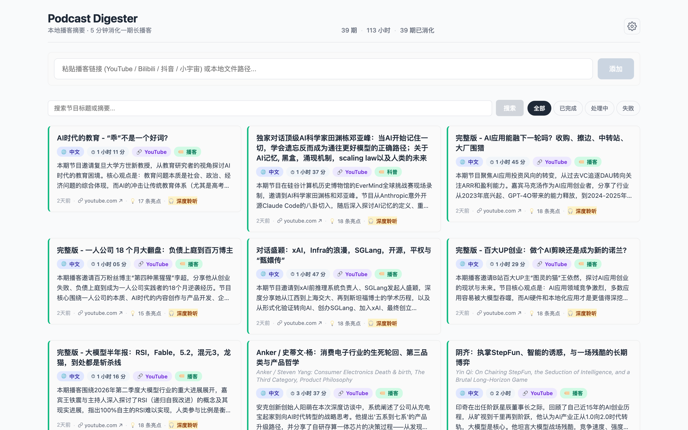
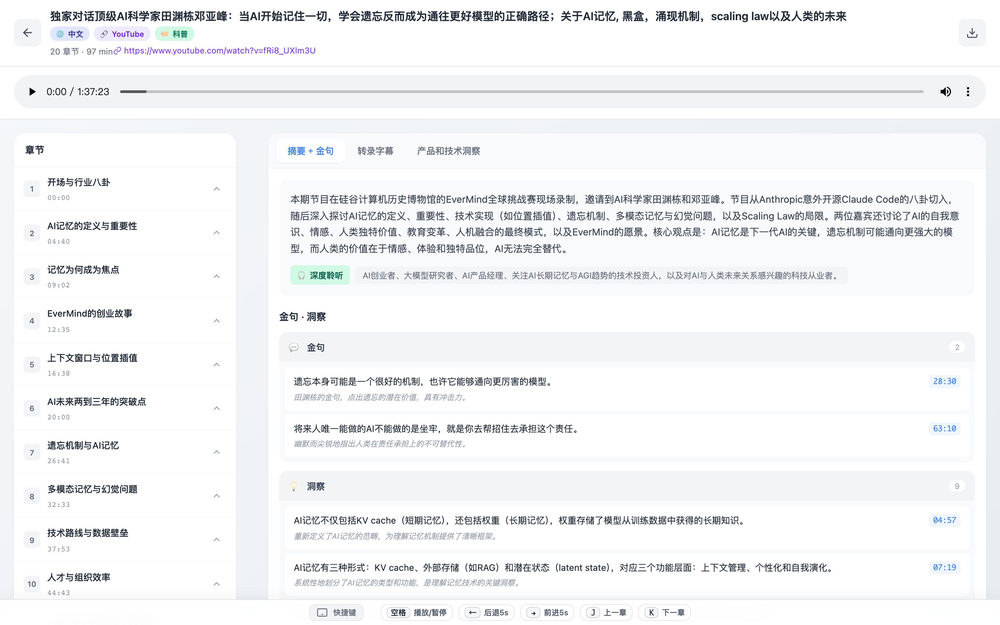
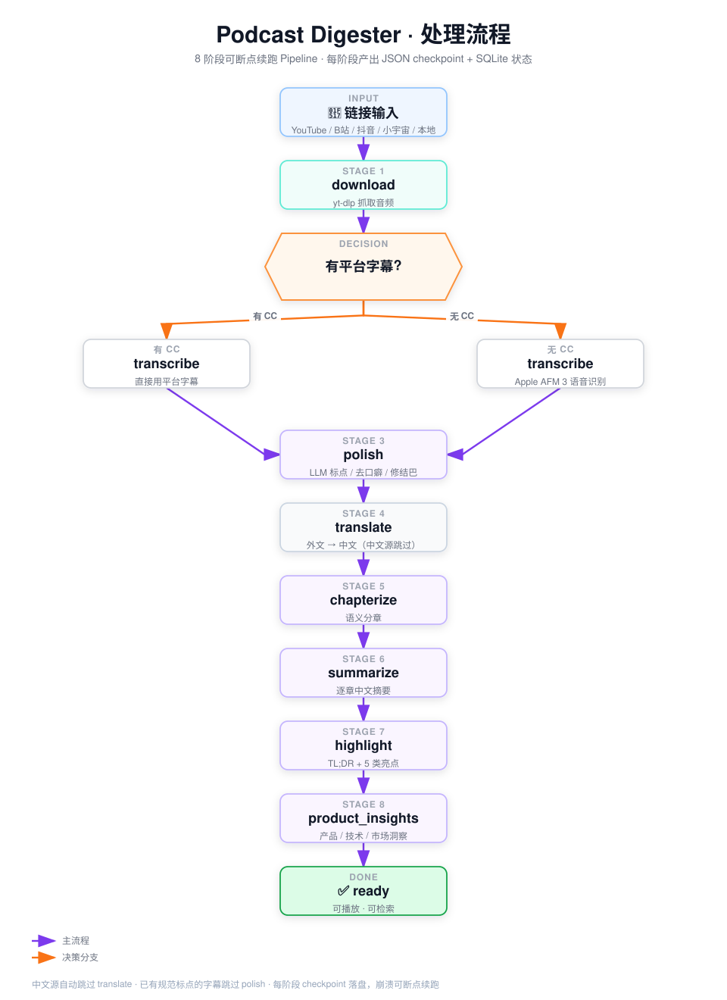
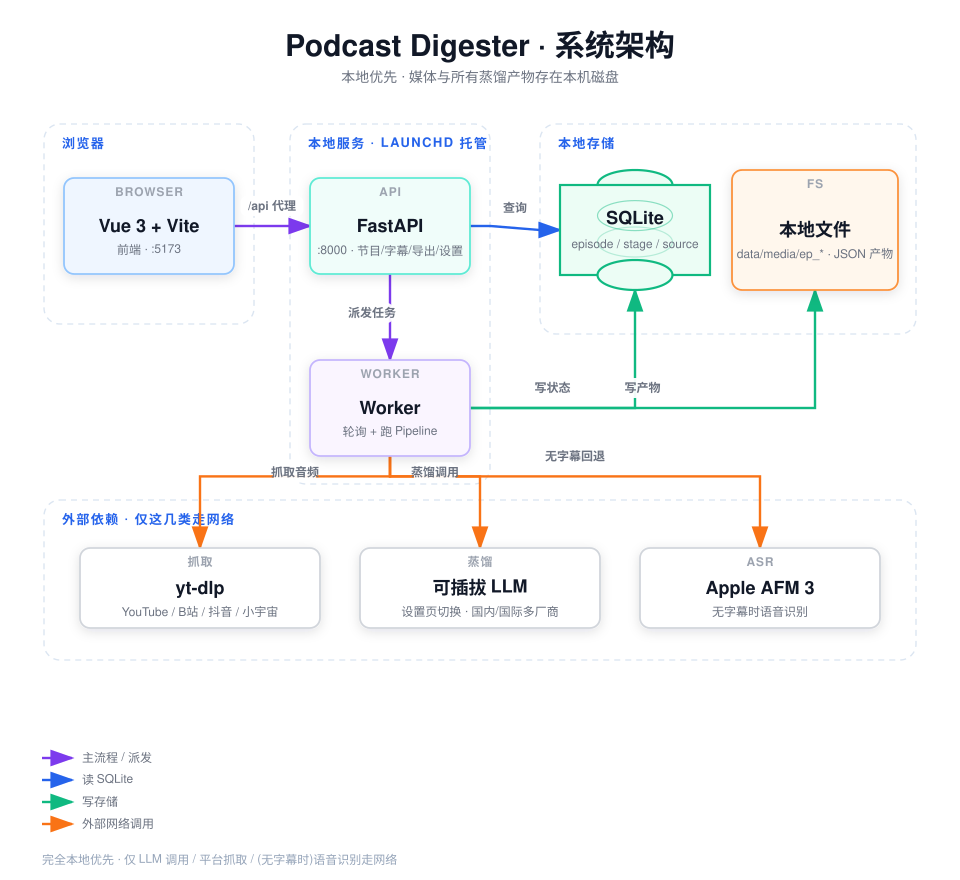

<div align="center">

# 🎙️ Podcast Digester

**Turn any podcast / video link into structured knowledge you can act on in 5 minutes.**

Paste a link → auto-queue, download, transcribe, clean, chapter, summarize, extract highlights → bilingual subtitles with click-to-seek.

A local-first, single-user tool built for high-density information consumers — PMs, researchers, investors.


</div>

🌐 [简体中文](./README.md) | **English**

---

## ✨ The Problem It Solves

When you face a 2-hour podcast, the real cost isn't *understanding* it — it's **not knowing whether it's worth your time.** Podcast Digester distills an episode into:

- A one-line **TL;DR** + a **worth-listening verdict** (`Deep Listen` / `Skim` / `Skip` — defaults to `Skim` when unsure)
- A **chapter outline** with per-chapter Chinese summaries
- Five kinds of **highlights** (legend below), each with the original subtitle citation and a timestamp
- **Product / technical / market** insights, plus a list of companies mentioned
- **Bilingual subtitles** precisely aligned to the player timeline — click a chapter or highlight to seek

> Decide in 5 minutes; when you choose to deep-listen, the subtitles and highlights help you skim-listen.

### Highlight legend

| Tag | Meaning | Example |
|------|---------|---------|
| `fact` | A verifiable key data point / fact | "Revenue grew 40% in 2025" |
| `insight` | An opinion / judgment / conclusion | "The real moat is distribution, not the model" |
| `quote` | A quotable line | "We didn't invent the wheel; we paved the road" |
| `contrarian` | A view against consensus | "Everyone's bullish, but supply is already oversupplied" |
| `story` | A concrete case / narrative | "Their first three months served only 7 users…" |

## 🖼️ Screenshots

<div align="center">
<table>
<tr><td align="center"><b>Library</b> — paste a link, see processing status, jump back to the source video</td></tr>
<tr><td></td></tr>
<tr><td align="center"><b>Player</b> — bilingual subtitles / chapters / summary / highlights / insights, click to seek</td></tr>
<tr><td></td></tr>
</table>
</div>

**What to look for in the player view:**
- A one-line **TL;DR** at the top + a **verdict** badge (`Deep Listen` / `Skim` / `Skip`)
- **Chapter ticks** on the timeline; click a chapter title to jump
- Five kinds of **highlights** in the right pane, each with the source citation + timestamp; click to seek to the clip
- **Bilingual subtitles** (zh / en) under the player, precisely aligned to the timeline
- **Glossary panel**: batch-correct names / terms, browse accumulated entries

## 🧠 Pipeline

Each episode flows through these stages in order, with **resumable checkpoints** (per-stage JSON + SQLite state machine):

<div align="center">



</div>

Chinese sources auto-skip `translate`; platform subtitles that already have proper punctuation auto-skip `polish` — avoiding needless LLM cost.

| Stage | Output |
|-------|--------|
| `download` | audio file (`data/media/ep_*/`), plus a title-named copy in the audio library |
| `transcribe` | timestamped subtitle segments (`transcript.json`) |
| `polish` / `translate` | normalized punctuation + bilingual fields (`text_zh` / `text_en`); the global glossary is auto-applied after polish |
| `chapterize` | chapter titles and time ranges |
| `summarize` | per-chapter Chinese summaries |
| `highlight` | TL;DR + verdict + five highlight kinds (with citation / timestamp) |
| `product_insights` | product / tech / market insights + mentioned companies |

## 📬 Queue & Resumability

Paste several links and walk away — a built-in **serial FIFO queue** processes one episode at a time while the rest wait:

- **Enqueue:** each pasted link creates a `pending` job (ordered by submission time; rate-limited to 5 per minute)
- **Serial processing:** a singleton Worker (guaranteed by an `fcntl` file lock) polls every 5 seconds and processes jobs strictly in `created_at` order — no concurrent resource contention
- **Resumable checkpoints:** every stage writes a checkpoint; after a restart or crash, processing resumes **exactly at the failed stage** — no repeated LLM calls for finished work
- **Crash self-healing:** each poll, the Worker scans for orphan jobs stuck in `downloading / asr_running / llm_running` mid-states and safely resets them into the queue
- **Smart retries:** transient errors (CDN flakiness / rate limits, classified by the downloader as `DownloadTemporaryError`) retry with exponential backoff (10s → 20s → 40s, 3 attempts by default); permanent errors (invalid URL / deleted video) go straight to `failed` — no spinning, no queue blockage

## 📝 Subtitle Cleaning & Glossary Correction

ASR filler words, stuttering, and name / terminology errors are handled in two layers:

**Layer 1 · LLM cleaning** (the `polish` stage): punctuation normalization, filler / stutter removal, spoken-language smoothing, plus entity harvesting that unifies names and terms across the whole episode.

**Layer 2 · Global glossary:** every name / term you correct is stored as "correct form ← wrong variants" — **fix once, benefit forever**:

- **Batch correction:** in the player's glossary panel, enter "wrong → right", **preview the hit counts** (subtitles N segments · paragraphs N · title · chapters N · summaries N · highlights N · insights N), then apply to **all seven places** in one click — including the paragraph text the player actually renders (`paragraph_mappings`, with the translated Chinese) and the library-card title, leaving no stale copies behind. The entry is added to the glossary automatically
- **Editor self-learning:** editing a word in the subtitle editor (even equal-length edits like `杨志玲→杨植麟`) auto-adds it to the glossary via difflib diffing + CJK backtracking that captures the **full name** — never a fragment like "植麟←志玲" that would damage unrelated text
- **Auto-apply to new episodes:** the glossary is shared globally; every new episode gets a **deterministic apply** of all entries after polish (`PODCAST_DIGESTER_AUTO_GLOSSARY`, on by default) — the transcript is clean at the source, so downstream summaries / highlights / insights inherit the corrections
- **Idempotent & safe:** string replacement only hits wrong variants — already-correct text is never re-modified; entries merge with dedup, so re-applying never creates duplicates

> There's also a more aggressive **LLM transcript correction** (`PODCAST_DIGESTER_LLM_CORRECT_TRANSCRIPT`, off by default): uses the LLM with title / description context to fix homophone errors before polish — adds ~100s of LLM time and cost per episode, enable as needed.

## 📤 Export & Audio Library

- **HTML export:** one click in the player exports the whole episode (summary / chapters / highlights / insights); check "include full transcript" to attach the **complete LLM-cleaned original transcript**, with highlight sentences auto-**bolded**
- **Audio library:** after download, a copy of the audio is saved under the **episode title** (Chinese title preferred) in `data/audio_library/` — easy to find by name in your file manager; the original file is untouched, so online playback is unaffected. Relocate it anywhere via `PODCAST_DIGESTER_AUDIO_OUTPUT_DIR`
- **Source links:** every library card shows its source (`youtube.com ↗` / `xiaoyuzhoufm.com ↗` …), one click back to the original video

## 🏗️ Architecture

<div align="center">



</div>

**Fully local-first:** media files and all distilled artifacts live on your own disk; only LLM calls, platform fetches, and (subtitle-less) speech recognition go over the network.

## 🔌 Pluggable LLM (multi-provider)

All distill stages (polish / translate / chapterize / summarize / highlight / insights) share **one unified entry point**, `app/llm/client.py::complete()`, which dispatches between two adapters by protocol:

- `openai_compatible` — wraps `openai.AsyncOpenAI`; covers DeepSeek / OpenAI / GLM / Qwen / Doubao / Kimi and other OpenAI-compatible endpoints
- `anthropic_compatible` — wraps `anthropic.AsyncAnthropic`; covers the Claude family

### Two ways to configure

**Option A · Settings page (recommended, zero code)** — after launch, click the gear icon to open **Settings**:

- Providers grouped by **domestic / overseas** in a dropdown; selecting one pre-fills the default endpoint and model
- Enter your API Key (saved value echoes back only as `****` + last 4, never in full)
- Custom-compatible endpoints let you set `base_url` and **fetch the models that endpoint exposes in one click**; named-vendor endpoints are locked and cannot be changed
- **Test connection** sends a tiny request with the unsaved draft values to verify Key / endpoint / model
- Saving writes to SQLite and **hot-reloads into both API and Worker** — no restart needed

**Option B · Environment variables** — see the switching examples below (good for scripts / headless deploys / CI). Switching providers is just an env-var change — **no code changes.**

### Supported provider presets

| `LLM_PROVIDER` | Region | Protocol (`provider_type`) | Default endpoint | Default model | Notes |
|----------------|:--:|----------------------------|------------------|---------------|-------|
| `deepseek` | domestic | `openai_compatible` | `api.deepseek.com` | `deepseek-v4-flash` | Recommended, great value |
| `glm` | domestic | `openai_compatible` | `open.bigmodel.cn/api/paas/v4` | `glm-4-flash` | Zhipu standard endpoint |
| `glm-coding` | domestic | `openai_compatible` | `open.bigmodel.cn/api/coding/paas/v4` | *（fetch then pick）* | Zhipu Coding-Plan dedicated endpoint |
| `qwen` | domestic | `openai_compatible` | `dashscope.aliyuncs.com/compatible-mode/v1` | `qwen-plus` | Tongyi Qianwen |
| `doubao` | domestic | `openai_compatible` | `ark.cn-beijing.volces.com/api/v3` | *（fill in）* | ByteDance Doubao; the model id is an endpoint id |
| `moonshot` | domestic | `openai_compatible` | `api.moonshot.cn/v1` | `moonshot-v1-8k` | Moonshot Kimi |
| `openai` | overseas | `openai_compatible` | SDK default | `gpt-4o-mini` | OpenAI official |
| `anthropic` | overseas | `anthropic_compatible` | SDK default | `claude-3-5-sonnet-latest` | Claude family |
| `openai-compatible` | — | `openai_compatible` | custom | custom | any OpenAI-compatible endpoint |
| `anthropic-compatible` | — | `anthropic_compatible` | custom | custom | any Anthropic-compatible endpoint |

> **base_url locking:** named vendors (the first 8 above) have a fixed preset endpoint that cannot be changed; the two "custom-compatible" rows at the bottom let you freely set `base_url`. Different endpoints / plans are split into separate providers (e.g. GLM standard vs Coding-Plan endpoint).
>
> **DeepSeek model names:** the legacy `deepseek-chat` / `deepseek-reasoner` names were retired on 2026/07/24 — the endpoint aliases them to the non-thinking / thinking modes of `deepseek-v4-flash`. Use `deepseek-v4-flash` directly (the default; the adapter injects `thinking:disabled` to reproduce non-thinking behavior) or `deepseek-v4-pro`.

### Switching examples (`.env`)

```bash
# —— DeepSeek (default) ——
LLM_PROVIDER=deepseek
LLM_API_KEY=sk-xxxxxxxx
LLM_MODEL=deepseek-v4-flash      # optional; empty uses the preset default

# —— Anthropic Claude ——
LLM_PROVIDER=anthropic
LLM_API_KEY=sk-ant-xxxxxxxx
LLM_MODEL=claude-3-5-sonnet-latest

# —— Any self-hosted / third-party OpenAI-compatible endpoint ——
LLM_PROVIDER=openai-compatible
LLM_PROVIDER_TYPE=openai_compatible   # generic presets need an explicit protocol
LLM_BASE_URL=https://your-endpoint.com/v1
LLM_API_KEY=xxxxxxxx
LLM_MODEL=your-model
```

> **Config priority:** Settings page (runtime override) > `LLM_*` > `DEEPSEEK_*` (backward-compat aliases) > `PROVIDERS[provider]` preset defaults.
>
> **Security:** a `base_url` entered on the settings page passes an SSRF guard (must be `https://`, rejects internal / loopback / cloud-metadata / CGNAT), and the SDK disables redirect-following to prevent the key leaking via a redirect; the key is read only from env vars / the settings page and never returned in full. `LLM_BASE_URL` is an operator escape hatch (enterprise proxy / mirror gateway, may be an internal address) and is treated as trusted, bypassing the guard. See `app/llm/config.py`.

## 📥 Multi-source Support

| Source | Notes |
|------|------|
| **YouTube** | Prefers platform subtitles (manual / auto CC); fail-fast probe falls back to ASR when none exist |
| **Bilibili** | Anti-bot requires cookies: auto-uses your browser (Chrome, etc.) login session |
| **Xiaoyuzhou** | Chinese podcast platform |
| **Douyin** | Includes anti-bot bypass (curl-cffi / Playwright CDP, optional) |
| **Local files** | Feed in an already-downloaded audio/video file |

Cookie parsing for auth-required platforms is **unified** across the download and title-fetch paths (browser first, `cookies.txt` fallback) — no more "downloaded audio but couldn't fetch the title" mismatches.

### 🔑 Getting cookies (for auth-required platforms)

After cloning, platforms like Bilibili — or parts of YouTube (age / region locks) — need a login session. **Browser first, `cookies.txt` fallback** — pick either:

**Option A · Auto-read from browser (recommended, zero config)**

Just **log in** to the platform once in a local browser — the app auto-reads the login session from Chrome / Edge / Firefox / Safari. **No file to export.** Log in once in that browser before downloading.

**Option B · `cookies.txt` (fallback, for servers / headless machines)**

1. Install the browser extension **"Get cookies.txt LOCALLY"** (search the Chrome / Edge store)
2. Open the target platform page and confirm you're logged in → export from the extension
3. Drop the file at one of these (auto-detected in this order):
   - project root `podcast-digester/cookies.txt` (travels with the project, recommended)
   - `~/.config/yt-dlp/cookies.txt` (shared globally)

> Neither option needs code changes or env vars — `app/utils/cookie_helper.py` probes "browser → `cookies.txt`" automatically.

## 🚀 Quick Start

### Prerequisites

- **Python 3.11–3.13** (⚠️ **3.14 not yet supported**: faster-whisper / pydantic and other deps lack prebuilt wheels and fail to build from source), **Node.js 18+**
- **ffmpeg** (yt-dlp post-processing needs it): macOS `brew install ffmpeg` / Linux `sudo apt install ffmpeg`
- An **LLM API key** for any supported provider (default DeepSeek — [get one here](https://platform.deepseek.com/))
- **macOS 13+** (recommended): full feature set; **subtitle-less sources** transcribed locally via Apple AFM 3 (first run builds the bridge — `setup.sh` does this automatically)
- **Linux / WSL**: supports only sources **with platform subtitles** (YouTube / Bilibili CC); subtitle-less sources need ASR, which is Apple-only and won't run on Linux
- Windows: untested

### 1. Clone

```bash
git clone https://github.com/Alliskyline2020/podcast-digester.git
cd podcast-digester
```

### 2. Install (one command, recommended)

```bash
./setup.sh
```

`setup.sh` does it all: Python version check (picks 3.11–3.13) → backend venv + deps → Playwright browser → (macOS) AFM 3 bridge build → frontend deps → creates `.env` from the template. Re-runnable (idempotent).

<details><summary>Prefer step-by-step (or customize)?</summary>

```bash
# Backend
cd backend
python3.12 -m venv venv            # use 3.11–3.13, not 3.14
source venv/bin/activate
pip install -r requirements.txt
python -m playwright install chromium   # pip only installs the Python binding; the browser is separate
# macOS also needs the ASR bridge:
cd tools && ./build_apple_asr.sh && cd ..

# Frontend
cd ../frontend && npm install
```

</details>

### 3. Configure your LLM

Two options (pick either):

- **Settings page (recommended):** after launch, click the gear icon, pick a provider (domestic / overseas group), enter your API Key, optionally **fetch models / test connection**, then save — **no `.env` editing**.
- **Environment variables:** edit `backend/.env` and fill in at least the key (default `provider=deepseek`); to switch providers, see "Switching examples" above.

```bash
LLM_API_KEY=sk-xxxxxxxx        # only needed for the env-var option; your DeepSeek / OpenAI / Claude / GLM … key
# to switch providers, see "Switching examples" above
```

### 4. Run (one command starts everything)

```bash
./start.sh        # starts API + frontend + Worker (all backgrounded, logs in logs/)
```

Open **http://localhost:5173/** and paste a podcast / video link. Paste several in a row if you like — the queue works through them one by one.

> `./start.sh --no-worker` starts only the API + frontend (for when you want to run the Worker manually); `./stop.sh` stops everything.

**Verify the install:** paste any YouTube link (most have auto CC, easiest), and within 1–2 minutes you should see a summary + highlights — that means the deployment succeeded.

### Common issues

- **Nothing happens after pasting a link** → check `logs/worker.log` to confirm the Worker is up (`./start.sh` starts it by default); if you used `--no-worker`, run `cd backend && source venv/bin/activate && python worker.py` in a separate terminal.
- **`pip install` fails with `Failed building wheel for av` / `pydantic-core`** → likely **Python 3.14** (missing prebuilt wheels). Switch to 3.11–3.13: `brew install python@3.12`, then re-run `./setup.sh`.
- **`vite: command not found` after `npm install`** → the machine has `NODE_ENV=production` set globally, so npm skipped devDependencies. Use `npm install --include=dev`, or `unset NODE_ENV` and reinstall (`setup.sh` already has this fallback).
- **Worker says `Another Worker is already running`** → a Worker is already running, or a stale lock was left after a crash. Remove the lock and retry: `rm .worker_pid` (project root).
- **YouTube fetch fails / times out** → usually the network; set a proxy `HTTPS_PROXY=http://127.0.0.1:7897` (adjust to your proxy).
- **Bilibili download fails** → anti-bot; you need a browser login session (cookie), see "🔑 Getting cookies" above.
- **A subtitle-less source stalls at transcribe (macOS)** → the AFM 3 bridge wasn't built; re-run `cd backend/tools && ./build_apple_asr.sh` (or `./setup.sh`).

> On macOS, consider running API + Worker under launchd for persistence (see `start.sh` / `stop.sh`, or write your own `~/Library/LaunchAgents/*.plist`) so long jobs survive terminal closes.

## ⚙️ Configuration

Core config is via environment variables (see `backend/.env.example`):

| Variable | Required | Default | Description |
|------|:---:|------|------|
| `LLM_PROVIDER` | | `deepseek` | provider preset name (see the table above) |
| `LLM_API_KEY` | ✅ | — | LLM key (legacy name `DEEPSEEK_API_KEY` is equivalent) |
| `LLM_MODEL` | | per preset | model name (legacy `DEEPSEEK_MODEL`) |
| `LLM_PROVIDER_TYPE` | | inferred from provider | explicit protocol: `openai_compatible` / `anthropic_compatible` |
| `LLM_BASE_URL` | | per preset | endpoint; empty uses the SDK default (legacy `DEEPSEEK_BASE_URL`) |
| `LLM_TEMPERATURE` | | `0.3` | sampling temperature |
| `LLM_MAX_TOKENS` | | empty | per-call generation cap; empty uses the provider default |
| `LLM_TIMEOUT` | | `60` | per-call timeout (seconds) |
| `PODCAST_DIGESTER_HOST` / `_PORT` | | `127.0.0.1` / `8000` | bind address / port |
| `PODCAST_DIGESTER_ADMIN_TOKEN` | | empty | Admin-endpoint auth (leave empty for local single-user) |
| `PODCAST_DIGESTER_MAX_LLM_COST` | | `5.0` | per-episode LLM cost cap (USD); aborts if exceeded |
| `PODCAST_DIGESTER_MAX_EPISODE_HOURS` | | `5.0` | per-episode length cap (hours) |
| `PODCAST_DIGESTER_AUTO_GLOSSARY` | | `true` | auto-apply the global glossary after polish on new episodes |
| `PODCAST_DIGESTER_LLM_CORRECT_TRANSCRIPT` | | `false` | LLM homophone correction before polish (+~100s per episode) |
| `PODCAST_DIGESTER_AUDIO_OUTPUT_DIR` | | `data/audio_library` | audio library directory (title-named audio copies) |
| `PODCAST_DIGESTER_WORKER_MAX_DOWNLOAD_RETRIES` | | `3` | max retries for transient download errors |
| `PODCAST_DIGESTER_WORKER_RETRY_BACKOFF` | | `10` | retry backoff base (seconds), grows as 2^n |
| `HTTPS_PROXY` / `HTTP_PROXY` | | empty | proxy for reaching YouTube etc. |

Subtitle quality, chapter window, highlight counts, ASR polling, and more are tunable in `backend/app/config.py`.

## 📁 Project Structure

```
podcast-digester/
├── backend/
│   ├── app/
│   │   ├── main.py              # FastAPI entry + route aggregation + frontend static hosting
│   │   ├── config.py            # env-driven config
│   │   ├── pipeline.py          # multi-stage pipeline orchestration (resumable)
│   │   ├── database.py          # SQLite async repository + state machine + migration runner
│   │   ├── asr_afm3.py          # Apple AFM 3 ASR wrapper
│   │   ├── routers/             # FastAPI route layer (episodes / export / glossary / subtitles / llm_config …)
│   │   ├── llm/                 # multi-provider adapter layer (complete() entry)
│   │   │   ├── client.py        #   unified dispatch by provider_type
│   │   │   ├── protocols.py     #   OpenAI / Anthropic adapter
│   │   │   ├── config.py        #   PROVIDERS presets + get_config + SSRF guard (trust by source)
│   │   │   └── cost.py          #   per-provider/model price table (cost estimate)
│   │   ├── sources/             # per-platform handlers (youtube/bilibili/douyin/xiaoyuzhou/local)
│   │   ├── services/            # subtitle alignment / polish / glossary correction / paragraph mapping
│   │   ├── llm_pipeline/        # LLM distill tasks: chapter / summary / translate / highlight / insight
│   │   └── utils/               # cookie / video-title / audio-library / validation helpers
│   ├── worker.py                # queue Worker (singleton lock · FIFO · orphan recovery · backoff retry)
│   ├── tests/                   # pytest (unit + integration + smoke, 650+ cases)
│   └── requirements.txt
├── frontend/
│   ├── src/
│   │   ├── views/               # LibraryView / PlayerView / SettingsView
│   │   ├── components/          # ExportModal / TranscriptEditor / OutlinePane / HighlightCard …
│   │   └── utils/               # stage progress / formatting
│   └── tests/                   # Vitest (120+ cases)
├── data/                        # SQLite + media/ep_* + audio_library (gitignored)
├── docs/                        # screenshots / architecture diagrams / transcript-correction guide
└── start.sh / stop.sh / setup.sh  # one-click install / start / stop
```

## 🧪 Tests

CI (GitHub Actions) runs backend pytest + frontend vitest + a frontend build smoke on every push.

```bash
# Backend (650+ cases; markers: unit / integration / api / database / llm)
cd backend && source venv/bin/activate && pytest tests

# Unit tests only (fast, no network)
pytest tests -m unit

# Coverage (CI gate fail-under=45)
pytest --cov=app --cov-report=term-missing

# Frontend (120+ cases)
cd frontend && npm test
```

## 🔒 Privacy & Cost

- **Local-first:** audio and all distilled artifacts stay on your own disk; only LLM calls, platform fetches, and (subtitle-less) speech recognition go over the network.
- **Cost-bounded:** a per-episode LLM spend above `PODCAST_DIGESTER_MAX_LLM_COST` (default $5) auto-aborts; `app/llm/cost.py` estimates each call's cost by provider / model.
- **Key safety:** the LLM key is read from env vars or the settings page and never returned in full (only `****` + last 4); a `base_url` entered on the settings page passes an SSRF guard (rejects http / private / loopback / cloud-metadata), and the SDK disables redirect-following to prevent key leakage.

## 🛣️ Roadmap

- [x] Multi-source (YouTube / Bilibili / Douyin / Xiaoyuzhou / local)
- [x] Serial queue + resumable pipeline + crash self-healing + download backoff retries
- [x] Bilingual subtitles (`text_zh` / `text_en`) with click-to-seek
- [x] Anti-bot auth (Bilibili cookies, subtitle-less fail-fast)
- [x] Pluggable multi-provider LLM (DeepSeek / OpenAI / Claude / GLM / Qwen / Doubao / Kimi)
- [x] Settings page to configure the LLM graphically (domestic/overseas grouping · base_url locking · model auto-fetch · test connection)
- [x] Global glossary correction (batch-correct · editor self-learning · auto-apply to new episodes)
- [x] HTML export (full cleaned transcript + bolded highlights) and a title-named audio library
- [ ] More platforms (Twitter/X, TikTok)
- [ ] Pinyin fuzzy variant discovery (auto-suggested glossary corrections)
- [ ] Full-text search / cross-episode knowledge graph
- [ ] Mobile-responsive UI

## 📚 Docs

- [`docs/transcript-correction-guide.md`](./docs/transcript-correction-guide.md) — Transcript-correction guide (Chinese)
- [`CHANGELOG.md`](./CHANGELOG.md) — Changelog
- [`CONTRIBUTING.md`](./CONTRIBUTING.md) — Contribution guide

## 🙏 Acknowledgements

- [**yt-dlp**](https://github.com/yt-dlp/yt-dlp) — multi-platform media download
- [**DeepSeek**](https://www.deepseek.com/) / [**OpenAI**](https://openai.com/) / [**Anthropic**](https://www.anthropic.com/) — reasoning / summary / highlight LLM (pick any one)
- **Apple AFM 3** — speech recognition when no subtitles are available
- [**feiskyer/video-skills**](https://github.com/feiskyer/video-skills) — reference for multi-platform download & transcription workflows
- [**FastAPI**](https://fastapi.tiangolo.com/) · [**Vue.js**](https://vuejs.org/) · [**Vite**](https://vitejs.dev/)

## 📄 License

[MIT License](./LICENSE) © 2026 Al Li

This project is for personal learning and research only. Please respect the terms of service of each content platform and your local copyright law; downloaded / transcribed content remains the property of its original author.
