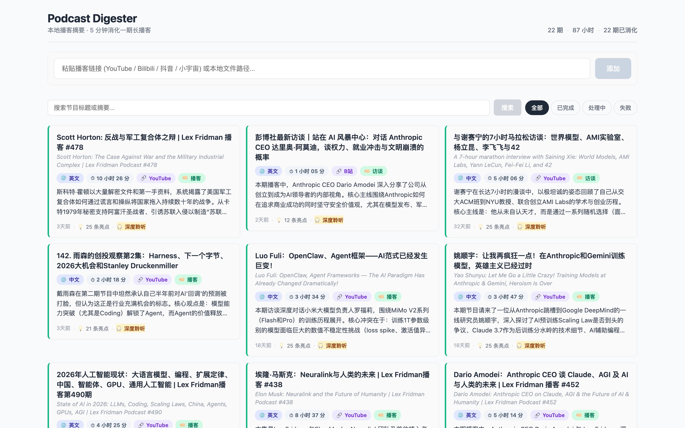
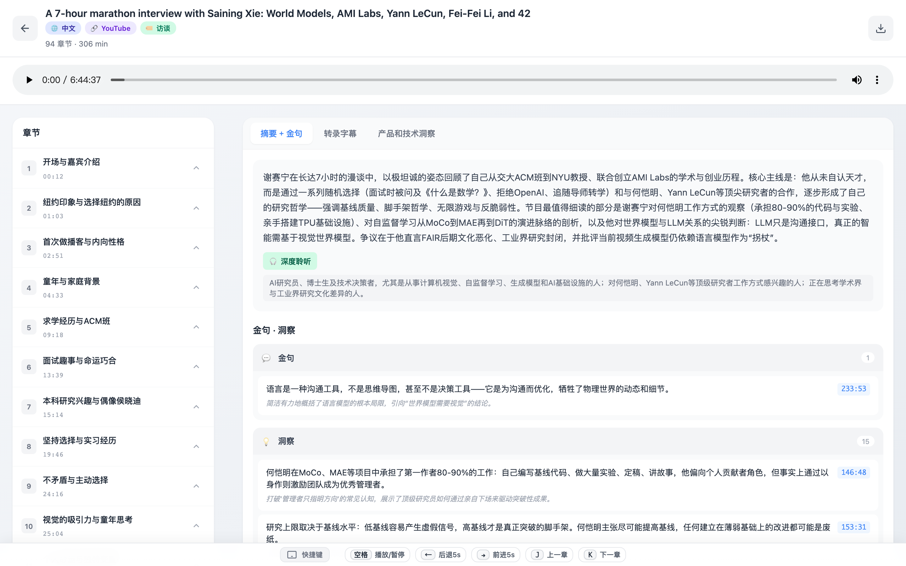
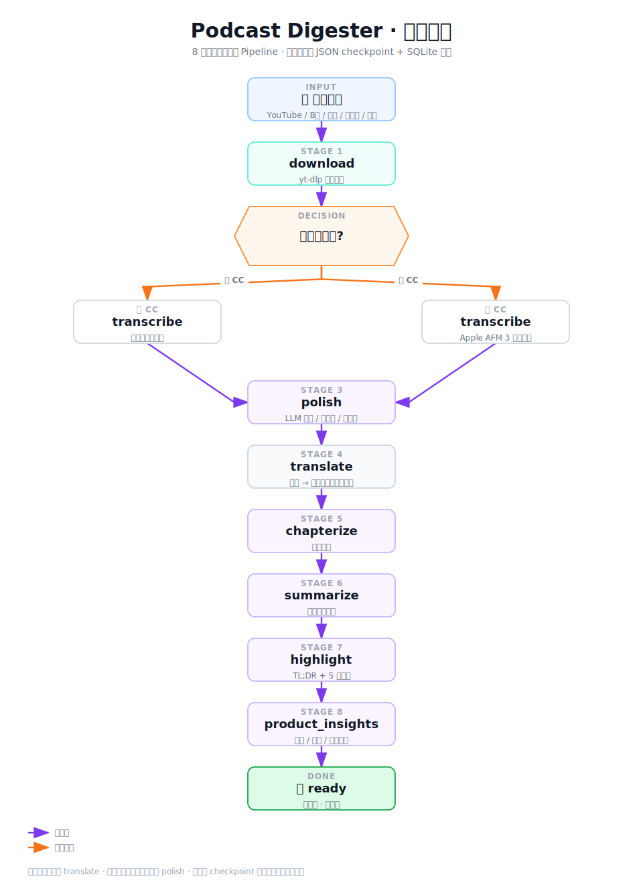
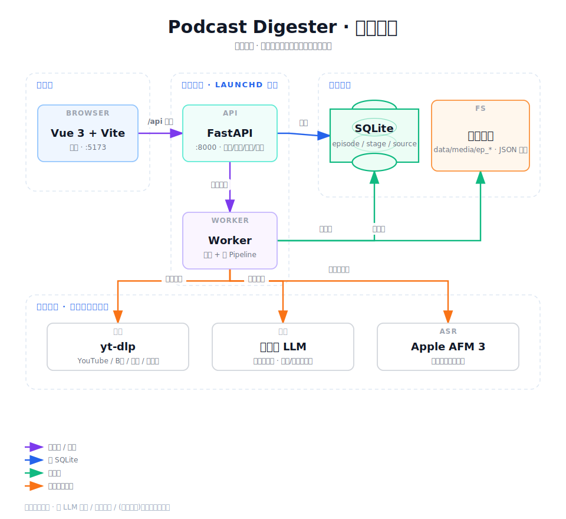

<div align="center">

# 🎙️ Podcast Digester

**把任意播客 / 视频链接，变成 5 分钟内可决策的结构化知识。**

粘贴一个链接 → 自动下载、转录、分章、摘要、提炼亮点 → 双语字幕点击即跳转播放。

本地单用户工具，为中文 PM、研究员、投资人这类「高密度信息消费者」而生。


</div>

🌐 **简体中文** | [English](./README.en.md)

---

## ✨ 它解决什么问题

信息工作者面对一集 2 小时的播客，最大的成本不是「听不懂」，而是**「不知道值不值得听」**。Podcast Digester 把一集音频蒸馏成：

- 一句话 **TL;DR** + **值听裁定**（`Deep Listen` / `Skim` / `Skip` 三档，拿不准默认 `Skim`）
- **章节大纲**与逐章中文摘要
- 五类**精华亮点**（见下方图例），每条都带原始字幕引用与时间戳
- **产品 / 技术 / 市场**三个维度的洞察，以及节目中提到的公司清单
- 与播放器时间轴**精确对齐的双语字幕**，点击章节或亮点直接 seek

> 决策只要 5 分钟；决定深听时，字幕和亮点帮你跳着听。

### 亮点五类图例

| 标签 | 含义 | 例子 |
|------|------|------|
| `fact` 事实 | 可查证的关键数据 / 事实 | 「该公司 2025 年营收增长 40%」 |
| `insight` 洞见 | 观点性的结论或判断 | 「真正护城河是分发，不是模型」 |
| `quote` 金句 | 值得引用的原话 | 「我们没有发明轮子，我们铺了路」 |
| `contrarian` 反共识 | 与主流相反的看法 | 「大家都看多，但供给端已经过剩」 |
| `story` 故事 | 具体的案例 / 叙事 | 「他们头三个月只服务了 7 个用户……」 |

## 🖼️ 截图

<div align="center">
<table>
<tr><td align="center"><b>节目库</b> — 粘贴链接、查看处理状态、点击进入</td></tr>
<tr><td></td></tr>
<tr><td align="center"><b>播放器</b> — 双语字幕 / 章节 / 摘要 / 亮点 / 洞察，点击即跳转</td></tr>
<tr><td></td></tr>
</table>
</div>

**在播放器视图里找这些：**
- 顶部 **TL;DR 一句话总结** + **值听裁定**徽标（`Deep Listen` / `Skim` / `Skip`）
- 时间轴上的**章节刻度**，点击章节标题直接跳转
- 右栏五类**亮点**，每条带原始字幕引用 + 时间戳，点击跳到对应片段
- 播放区下方**双语字幕**（中 / 英），与时间轴精确对齐

## 🧠 工作流（Pipeline）

每集内容按下列阶段顺序处理，**可断点续跑**（每阶段产出 JSON checkpoint + SQLite 状态）：

<div align="center">



</div>

中文源会自动跳过 `translate`；已有规范标点的平台字幕会跳过 `polish`，避免无谓的 LLM 开销。

| 阶段 | 产出 |
|------|------|
| `download` | 音频文件（`data/media/ep_*/`） |
| `transcribe` | 带时间戳的字幕段（`transcript.json`） |
| `polish` / `translate` | 规范标点 + 双语字段（`text_zh` / `text_en`） |
| `chapterize` | 章节标题与时间区间 |
| `summarize` | 逐章中文摘要 |
| `highlight` | TL;DR + 值听裁定 + 五类亮点（含引用 / 时间戳） |
| `product_insights` | 产品 / 技术 / 市场洞察 + 提到的公司清单 |

## 🏗️ 架构

<div align="center">



</div>

**完全本地优先**：媒体文件与所有蒸馏产物存在本机磁盘；只有 LLM 调用、平台抓取、（无字幕时的）语音识别走网络。

## 🔌 可插拔 LLM（多 Provider）

蒸馏阶段（润色 / 翻译 / 分章 / 摘要 / 亮点 / 洞察）共用**一个统一入口** `app/llm/client.py::complete()`，底层按协议在两种 adapter 间分发：

- `openai_compatible` —— `openai.AsyncOpenAI` 包装，覆盖 DeepSeek / OpenAI / GLM / 通义 / 豆包 / Kimi 等 OpenAI 兼容端点
- `anthropic_compatible` —— `anthropic.AsyncAnthropic` 包装，覆盖 Claude 系列

切换 provider 只改环境变量，**不改一行代码**。

### 支持的 Provider 预设

| `LLM_PROVIDER` | 协议 (`provider_type`) | 默认端点 | 默认模型 | 备注 |
|----------------|------------------------|----------|----------|------|
| `deepseek` | `openai_compatible` | `api.deepseek.com` | `deepseek-chat` | 推荐，性价比高 |
| `openai` | `openai_compatible` | SDK 官方默认 | `gpt-4o-mini` | OpenAI 官方 |
| `anthropic` | `anthropic_compatible` | SDK 官方默认 | `claude-3-5-sonnet-latest` | Claude 系列 |
| `glm` | `openai_compatible` | `open.bigmodel.cn/api/paas/v4` | `glm-4-flash` | 智谱 |
| `qwen` | `openai_compatible` | `dashscope.aliyuncs.com/compatible-mode/v1` | `qwen-plus` | 通义千问 |
| `doubao` | `openai_compatible` | `ark.cn-beijing.volces.com/api/v3` | *（自填）* | 字节豆包，模型 id 实为 endpoint id |
| `moonshot` | `openai_compatible` | `api.moonshot.cn/v1` | `moonshot-v1-8k` | 月之暗面 Kimi |
| `openai-compatible` | `openai_compatible` | 自填 | 自填 | 任意 OpenAI 兼容端点 |
| `anthropic-compatible` | `anthropic_compatible` | 自填 | 自填 | 任意 Anthropic 兼容端点 |

### 切换示例（`.env`）

```bash
# —— DeepSeek（默认）——
LLM_PROVIDER=deepseek
LLM_API_KEY=sk-xxxxxxxx
LLM_MODEL=deepseek-chat          # 可选；留空则用预设默认

# —— Anthropic Claude ——
LLM_PROVIDER=anthropic
LLM_API_KEY=sk-ant-xxxxxxxx
LLM_MODEL=claude-3-5-sonnet-latest

# —— 智谱 GLM ——
LLM_PROVIDER=glm
LLM_API_KEY=xxxxxxxx
LLM_MODEL=glm-4-flash

# —— 任意自建 / 第三方 OpenAI 兼容端点 ——
LLM_PROVIDER=openai-compatible
LLM_PROVIDER_TYPE=openai_compatible   # 通用兜底需显式指定协议
LLM_BASE_URL=https://your-endpoint.com/v1
LLM_API_KEY=xxxxxxxx
LLM_MODEL=your-model
```

> **配置优先级**：`LLM_*` > `DEEPSEEK_*`（向后兼容别名）> `PROVIDERS[provider]` 预设默认值。
>
> **SSRF 守卫**：`LLM_BASE_URL` 必须是 `https://`，且禁止指向 `.local` / 内网 / 本机地址（LLM 密钥不可明文走 http 或内网）。详见 `app/llm/config.py`。

## 📥 多源支持

| 来源 | 说明 |
|------|------|
| **YouTube** | 优先用平台字幕（manual / auto CC），无字幕时 fail-fast 探测后回退 ASR |
| **Bilibili** | 反爬需 cookie：自动用浏览器（Chrome 等）登录态鉴权 |
| **小宇宙** | 中文播客平台 |
| **抖音** | 含反爬绕过（curl-cffi / Playwright CDP，可选） |
| **本地文件** | 直接喂已下载的音视频文件 |

鉴权平台的 cookie 解析与下载路径**统一**复用同一套策略（浏览器优先，`cookies.txt` 兜底），下载与标题抓取都走它，不会再出现「下了音频却抓不到标题」的错位。

### 🔑 Cookie 获取（鉴权平台）

clone 项目后，B 站、部分 YouTube（年龄 / 地区限制）等需要登录态。**浏览器优先、`cookies.txt` 兜底**，任选其一：

**方式 A · 浏览器自动读取（推荐，零配置）**

在本机浏览器里**登录过**该平台即可——程序自动读取 Chrome / Edge / Firefox / Safari 的登录态，**无需导出任何文件**。下载前在该浏览器登录一次就行。

**方式 B · `cookies.txt`（兜底，服务器 / 无 GUI 环境）**

1. 浏览器装扩展 **「Get cookies.txt LOCALLY」**（Chrome / Edge 商店可搜到）
2. 打开目标平台网页并确认已登录 → 扩展里点导出
3. 把文件放到下面任一位置（程序按此顺序自动探测）：
   - 项目根目录 `podcast-digester/cookies.txt`（随项目走，推荐）
   - `~/.config/yt-dlp/cookies.txt`（全局共享）

> 两种方式都不用改代码或环境变量，`app/utils/cookie_helper.py` 自动按「浏览器 → `cookies.txt`」顺序探测。

## 🚀 快速开始

### 前置条件

- **Python 3.11–3.13**（⚠️ **3.14 暂不兼容**：faster-whisper / pydantic 等依赖缺预编译 wheel，会源码构建失败）、**Node.js 18+**
- **ffmpeg**（yt-dlp 后处理需要）：macOS `brew install ffmpeg` / Linux `sudo apt install ffmpeg`
- 任一支持 provider 的 **LLM API Key**（默认 DeepSeek，[在此获取](https://platform.deepseek.com/)）
- **macOS 13+**（推荐）：全功能；**无字幕源**可用 Apple AFM 3 本地转录（首次需编译桥接工具，`setup.sh` 会自动做）
- **Linux / WSL**：仅支持**自带平台字幕**的源（YouTube / B 站等有 CC 的内容）；无字幕源需 ASR，而 ASR 走 Apple 平台，Linux 无法回退
- Windows 未测试

### 1. 克隆

```bash
git clone https://github.com/Alliskyline2020/podcast-digester.git
cd podcast-digester
```

### 2. 安装（一键，推荐）

```bash
./setup.sh
```

`setup.sh` 自动完成：Python 版本检查（挑 3.11–3.13）→ 后端 venv + 依赖 → Playwright 浏览器 →（macOS）AFM 3 桥接编译 → 前端依赖 → 从模板创建 `.env`。可重复运行（幂等）。

<details><summary>想分步手动装（或自定义）</summary>

```bash
# 后端
cd backend
python3.12 -m venv venv            # 用 3.11–3.13，不要用 3.14
source venv/bin/activate
pip install -r requirements.txt
python -m playwright install chromium   # pip 只装 Python 绑定，浏览器要单独装
# macOS 还需编译 ASR 桥接：
cd tools && ./build_apple_asr.sh && cd ..

# 前端
cd ../frontend && npm install
```

</details>

### 3. 配置 LLM

编辑 `backend/.env`，至少填入密钥（默认 `provider=deepseek`）：

```bash
LLM_API_KEY=sk-xxxxxxxx        # 你的 DeepSeek / OpenAI / Claude / GLM … 密钥
# 想换 provider 见上方「可插拔 LLM」的切换示例
```

### 4. 运行

```bash
./start.sh        # 终端 1：启动 API + 前端
```

> ⚠️ `start.sh` 只起 **API + 前端**，**不启动 Worker**。Pipeline 由 Worker 跑，必须另开终端单独启动，否则粘贴链接后不会处理：

```bash
cd backend && source venv/bin/activate && python worker.py   # 终端 2：Worker
```

打开 **http://localhost:5173/** ，粘贴一个播客 / 视频链接即可。

**验证部署**：粘贴任意一条 YouTube 链接（多数带自动字幕，最省事），1–2 分钟内出现「摘要 + 亮点」即说明部署成功。

### 常见问题

- **粘贴链接后一直不动** → Worker 没起；`start.sh` 不含 Worker，需另开终端 `python worker.py`。
- **`pip install` 报 `Failed building wheel for av` / `pydantic-core`** → 多半是 **Python 3.14**（缺预编译 wheel）。改用 3.11–3.13：`brew install python@3.12` 后重跑 `./setup.sh`。
- **`npm install` 后 `vite: command not found`** → 机器全局设了 `NODE_ENV=production`，npm 跳过了 devDependencies。用 `npm install --include=dev`，或 `unset NODE_ENV` 后重装（`setup.sh` 已自带该兜底）。
- **Worker 报 `Another Worker is already running`** → 有 Worker 在跑，或上次崩溃留了锁。删锁再起：`rm /tmp/podcast_worker.pid`。
- **YouTube 抓取失败 / 超时** → 多为网络，需配代理 `HTTPS_PROXY=http://127.0.0.1:7897`（按你的代理改）。
- **B 站下载失败** → 反爬，需用浏览器登录态（cookie），见上方「🔑 Cookie 获取」。
- **无字幕源卡在 transcribe（macOS）** → AFM 3 桥接没编译，重跑 `cd backend/tools && ./build_apple_asr.sh`（或 `./setup.sh`）。

> macOS 下推荐用 launchd 常驻托管 API 与 Worker（参考根目录 `start.sh` / `stop.sh`，或自行编写 `~/Library/LaunchAgents/*.plist`），终端关闭也不会中断长任务。

## ⚙️ 配置

核心配置走环境变量（见 `backend/.env.example`）：

| 变量 | 必填 | 默认 | 说明 |
|------|:---:|------|------|
| `LLM_PROVIDER` | | `deepseek` | provider 预设名（见上方预设表） |
| `LLM_API_KEY` | ✅ | — | LLM 密钥（旧名 `DEEPSEEK_API_KEY` 等价） |
| `LLM_MODEL` | | 按预设 | 模型名（旧名 `DEEPSEEK_MODEL`） |
| `LLM_PROVIDER_TYPE` | | 按 provider 推断 | 显式指定协议：`openai_compatible` / `anthropic_compatible` |
| `LLM_BASE_URL` | | 按预设 | 端点；留空用 SDK 官方默认（旧名 `DEEPSEEK_BASE_URL`） |
| `LLM_TEMPERATURE` | | `0.3` | 采样温度 |
| `LLM_MAX_TOKENS` | | 空 | 单次生成上限；留空用 provider 默认 |
| `LLM_TIMEOUT` | | `60` | 单次请求超时（秒） |
| `PODCAST_DIGESTER_HOST` / `_PORT` | | `127.0.0.1` / `8000` | 绑定地址 / 端口 |
| `PODCAST_DIGESTER_ADMIN_TOKEN` | | 空 | 管理接口鉴权（本地单用户可留空） |
| `PODCAST_DIGESTER_MAX_LLM_COST` | | `5.0` | 单集 LLM 花费上限（美元），超过则中止 |
| `PODCAST_DIGESTER_MAX_EPISODE_HOURS` | | `5.0` | 单集时长上限（小时） |
| `HTTPS_PROXY` / `HTTP_PROXY` | | 空 | 访问 YouTube 等需要的代理 |

字幕质量、分章窗口、亮点条数、ASR 轮询等都有细粒度可调参数，详见 `backend/app/config.py`。

## 📁 项目结构

```
podcast-digester/
├── backend/
│   ├── app/
│   │   ├── main.py              # FastAPI 入口 + 路由聚合
│   │   ├── config.py            # 环境变量驱动的配置
│   │   ├── pipeline.py          # 8 阶段 Pipeline 编排（可断点续跑）
│   │   ├── database.py          # SQLite 异步仓储 + 状态机
│   │   ├── asr_afm3.py          # Apple AFM 3 语音识别封装
│   │   ├── llm/                 # 多 Provider 适配层（complete() 统一入口）
│   │   │   ├── client.py        #   统一分发：按 provider_type 选 adapter
│   │   │   ├── protocols.py     #   OpenAI / Anthropic adapter
│   │   │   ├── config.py        #   PROVIDERS 预设 + get_config + SSRF 守卫
│   │   │   └── cost.py          #   按 provider/模型 的价格表（成本估算）
│   │   ├── sources/             # 各平台解析器（youtube/bilibili/douyin/xiaoyuzhou/local）
│   │   ├── services/            # 字幕对齐 / 润色 / 段落映射等业务
│   │   ├── llm_pipeline/        # LLM 蒸馏任务：分章 / 摘要 / 翻译 / 亮点 / 洞察
│   │   └── utils/               # cookie / 视频标题 / 校验等工具
│   ├── tests/                   # pytest（单元 + 集成，392 用例）
│   └── requirements.txt
├── frontend/
│   ├── src/
│   │   ├── views/               # LibraryView（节目库）/ PlayerView（播放器）
│   │   ├── components/          # UI 组件
│   │   └── utils/               # 阶段进度 / 格式化等
│   └── tests/                   # Vitest
├── data/                        # SQLite + media/ep_*（gitignore，不入库）
├── docs/                        # 字幕校正指南
└── start.sh / stop.sh           # 一键启停
```

## 🧪 测试

```bash
# 后端（392 用例，含 unit / integration / api / database / llm 标记）
cd backend && source venv/bin/activate && pytest tests

# 只跑单元测试（快、无网络）
pytest tests -m unit

# 前端
cd frontend && npm test
```

## 🔒 隐私与成本

- **本地优先**：音频与所有蒸馏产物都落在本机磁盘；只有 LLM 调用、平台抓取、（无字幕时的）语音识别走网络。
- **成本可控**：单集 LLM 花费超过 `PODCAST_DIGESTER_MAX_LLM_COST`（默认 $5）自动中止；`app/llm/cost.py` 按 provider / 模型估算每次调用成本。
- **密钥安全**：LLM 密钥仅从环境变量读取，`base_url` 经 SSRF 守卫，禁止 http / 内网 / 本机端点。

## 🛣️ 路线图

- [x] 多源支持（YouTube / Bilibili / 抖音 / 小宇宙 / 本地）
- [x] 断点续跑 + 分阶段进度
- [x] 双语字幕（`text_zh` / `text_en`）与点击跳转
- [x] 反爬鉴权（B 站 cookie、无字幕 fail-fast）
- [x] 可插拔多 Provider LLM（DeepSeek / OpenAI / Claude / GLM / 通义 / 豆包 / Kimi）
- [ ] 更多平台（Twitter/X、TikTok）
- [ ] 全文检索 / 跨集知识图谱
- [ ] 移动端适配

## 📚 文档

- [`docs/transcript-correction-guide.md`](./docs/transcript-correction-guide.md) — 字幕校正指南
- [`CONTRIBUTING.md`](./CONTRIBUTING.md) — 贡献指南

## 🙏 致谢

- [**yt-dlp**](https://github.com/yt-dlp/yt-dlp) — 多平台媒体下载
- [**DeepSeek**](https://www.deepseek.com/) / [**OpenAI**](https://openai.com/) / [**Anthropic**](https://www.anthropic.com/) — 推理 / 摘要 / 亮点 LLM（任选其一）
- **Apple AFM 3** — 无字幕时的语音识别
- [**feiskyer/video-skills**](https://github.com/feiskyer/video-skills) — 多平台下载与转录工作流的参考
- [**FastAPI**](https://fastapi.tiangolo.com/) · [**Vue.js**](https://vuejs.org/) · [**Vite**](https://vitejs.dev/)

## 📄 许可证

[MIT License](./LICENSE) © 2026 Al Li

本项目仅供个人学习与研究使用。请遵守各内容平台的使用条款与当地版权法，下载 / 转录的内容版权归原作者所有。
