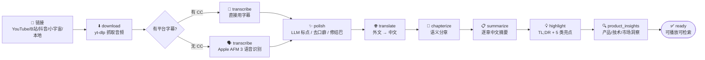
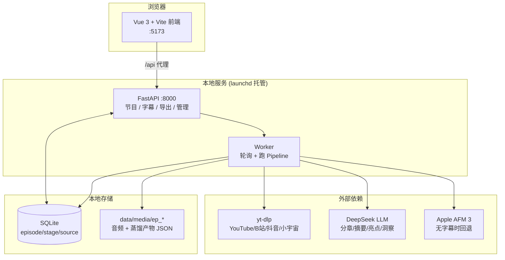

<div align="center">

# 🎙️ Podcast Digester

**把任意播客 / 视频链接，变成 5 分钟内可决策的结构化知识。**

粘贴一个链接 → 自动下载、转录、分章、摘要、提炼亮点 → 双语字幕点击即跳转播放。

本地单用户工具，为中文 PM、研究员、投资人这类「高密度信息消费者」而生。


</div>

---

## ✨ 它解决什么问题

信息工作者面对一集 2 小时的播客，最大的成本不是「听不懂」，而是**「不知道值不值得听」**。Podcast Digester 把一集音频蒸馏成：

- 一句话 **TL;DR** + **值听裁定**（Deep Listen / Skip）
- **章节大纲**与逐章中文摘要
- 五类**精华亮点**：`fact` 事实 / `insight` 洞见 / `quote` 金句 / `contrarian` 反共识 / `story` 故事，每条都带原始字幕引用与时间戳
- **产品 / 技术 / 市场**三个维度的洞察，以及节目中提到的公司清单
- 与播放器时间轴**精确对齐的双语字幕**，点击章节或亮点直接 seek

> 决策只要 5 分钟；决定深听时，字幕和亮点帮你跳着听。

## 🖼️ 截图

<div align="center">
<table>
<tr>
<td align="center"><b>节目库</b></td>
<td align="center"><b>播放器 · 章节 / 摘要 / 亮点</b></td>
</tr>
<tr>
<td></td>
<td></td>
</tr>
</table>
</div>

## 🧠 工作流（Pipeline）

每集内容按下列阶段顺序处理，**可断点续跑**（每阶段产出 JSON checkpoint + SQLite 状态）：



中文源会自动跳过 `translate`；已有规范标点的平台字幕会跳过 `polish`，避免无谓的 LLM 开销。

## 🏗️ 架构



**完全本地优先**：媒体文件与所有蒸馏产物存在本机磁盘；只有 LLM 调用、平台抓取、（无字幕时的）语音识别走网络。

## 📥 多源支持

| 来源 | 说明 |
|------|------|
| **YouTube** | 优先用平台字幕（manual / auto CC），无字幕时 fail-fast 探测后回退 ASR |
| **Bilibili** | 反爬需 cookie：自动用浏览器（Chrome 等）登录态鉴权 |
| **小宇宙** | 中文播客平台 |
| **抖音** | 含反爬绕过（curl-cffi / Playwright CDP，可选） |
| **本地文件** | 直接喂已下载的音视频文件 |

鉴权平台的 cookie 解析与下载路径**统一**复用同一套策略（浏览器优先，`cookies.txt` 兜底），下载与标题抓取都走它，不会再出现「下了音频却抓不到标题」的错位。

## 🚀 快速开始

### 前置条件

- **Python 3.11+**、**Node.js 18+**
- **DeepSeek API Key**（处理流程的核心依赖，[在此获取](https://platform.deepseek.com/)）
- macOS / Linux（Windows 未测试；服务管理用到了 launchd，Linux 需自行替换为 systemd 或前台运行）

### 1. 克隆

```bash
git clone https://github.com/Alliskyline2020/podcast-digester.git
cd podcast-digester
```

### 2. 后端

```bash
cd backend
python3 -m venv venv
source venv/bin/activate
pip install -r requirements.txt

cp .env.example .env
# 编辑 .env，填入 DEEPSEEK_API_KEY
```

### 3. 前端

```bash
cd ../frontend
npm install
```

### 4. 运行

一键启动（前台，启动 API 与前端）：

```bash
./start.sh
```

> ⚠️ `start.sh` 只起 **API + 前端**，不启动 Worker。Pipeline 由 Worker 跑，必须单独启动（见下方「终端 2」），否则粘贴链接后不会处理。

或分开跑：

```bash
# 后端 API（终端 1）
cd backend && source venv/bin/activate && uvicorn app.main:app --host 127.0.0.1 --port 8000

# Worker，跑 Pipeline（终端 2）—— 必须单独起，start.sh 不含
cd backend && source venv/bin/activate && python worker.py

# 前端（终端 3）
cd frontend && npm run dev
```

打开 **http://localhost:5173/** ，粘贴一个播客 / 视频链接即可。

> macOS 下推荐用 launchd 常驻托管 API 与 Worker（参考根目录 `start.sh` / `stop.sh`，或自行编写 `~/Library/LaunchAgents/*.plist`），终端关闭也不会中断长任务。

## ⚙️ 配置

核心配置走环境变量（见 `backend/.env.example`）：

| 变量 | 必填 | 默认 | 说明 |
|------|:---:|------|------|
| `DEEPSEEK_API_KEY` | ✅ | — | DeepSeek API 密钥 |
| `DEEPSEEK_MODEL` | | `deepseek-chat` | 简单任务模型；亮点 / 洞察内部自动切思考模型 |
| `DEEPSEEK_BASE_URL` | | `https://api.deepseek.com` | LLM 端点 |
| `PODCAST_DIGESTER_PORT` | | `8000` | API 端口 |
| `PODCAST_DIGESTER_ADMIN_TOKEN` | | 空 | 管理接口鉴权（本地单用户可留空） |
| `PODCAST_DIGESTER_MAX_LLM_COST` | | `5.0` | 单集 LLM 花费上限（美元） |
| `PODCAST_DIGESTER_MAX_EPISODE_HOURS` | | `5.0` | 单集时长上限 |
| `HTTPS_PROXY` / `HTTP_PROXY` | | 空 | 访问 YouTube 等需要的代理 |

字幕质量、分章窗口、亮点条数、ASR 轮询等都有细粒度可调参数，详见 `backend/app/config.py`。

## 📁 项目结构

```
podcast-digester/
├── backend/
│   ├── app/
│   │   ├── main.py              # FastAPI 入口 + 路由聚合
│   │   ├── config.py            # 环境变量驱动的配置
│   │   ├── pipeline.py          # 8 阶段 Pipeline 编排（可断点续跑）
│   │   ├── database.py          # SQLite 异步仓储 + 状态机
│   │   ├── asr_afm3.py          # Apple AFM 3 语音识别封装
│   │   ├── sources/             # 各平台解析器（youtube/bilibili/douyin/xiaoyuzhou/local）
│   │   ├── services/            # 字幕对齐 / 润色 / 段落映射等业务
│   │   ├── llm_pipeline/        # LLM 任务：分章 / 摘要 / 翻译 / 亮点 / 洞察
│   │   └── utils/               # cookie / 视频标题 / 校验等工具
│   ├── tests/                   # pytest（单元 + 集成，~370 用例）
│   └── requirements.txt
├── frontend/
│   ├── src/
│   │   ├── views/               # LibraryView（节目库）/ PlayerView（播放器）
│   │   ├── components/          # UI 组件
│   │   └── utils/               # 阶段进度 / 格式化等
│   └── tests/                   # Vitest
├── data/                        # SQLite + media/ep_*（gitignore，不入库）
├── docs/                        # PRD / 字幕校正指南 / 项目介绍 PPT
└── start.sh / stop.sh           # 一键启停
```

## 🧪 测试

```bash
# 后端
cd backend && source venv/bin/activate && pytest tests

# 前端
cd frontend && npm test
```

## 🛣️ 路线图

- [x] 多源支持（YouTube / Bilibili / 抖音 / 小宇宙 / 本地）
- [x] 断点续跑 + 分阶段进度
- [x] 双语字幕（`text_zh` / `text_en`）与点击跳转
- [x] 反爬鉴权（B 站 cookie、无字幕 fail-fast）
- [ ] 更多平台（Twitter/X、TikTok）
- [ ] 全文检索 / 跨集知识图谱
- [ ] 移动端适配

## 📚 文档

- [`docs/PRD.md`](./docs/PRD.md) — 产品需求文档
- [`docs/transcript-correction-guide.md`](./docs/transcript-correction-guide.md) — 字幕校正指南
- [`docs/presentation/`](./docs/presentation/) — 项目介绍 PPT（瑞士风版）

## 🙏 致谢

- [**yt-dlp**](https://github.com/yt-dlp/yt-dlp) — 多平台媒体下载
- [**DeepSeek**](https://www.deepseek.com/) — 推理 / 摘要 / 亮点 LLM
- **Apple AFM 3** — 无字幕时的语音识别
- [**feiskyer/video-skills**](https://github.com/feiskyer/video-skills) — 多平台下载与转录工作流的参考
- [**FastAPI**](https://fastapi.tiangolo.com/) · [**Vue.js**](https://vuejs.org/) · [**Vite**](https://vitejs.dev/)

## 📄 许可证

[MIT License](./LICENSE) © 2026 Al Li

本项目仅供个人学习与研究使用。请遵守各内容平台的使用条款与当地版权法，下载 / 转录的内容版权归原作者所有。
